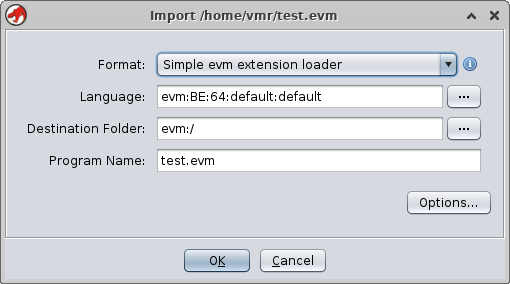
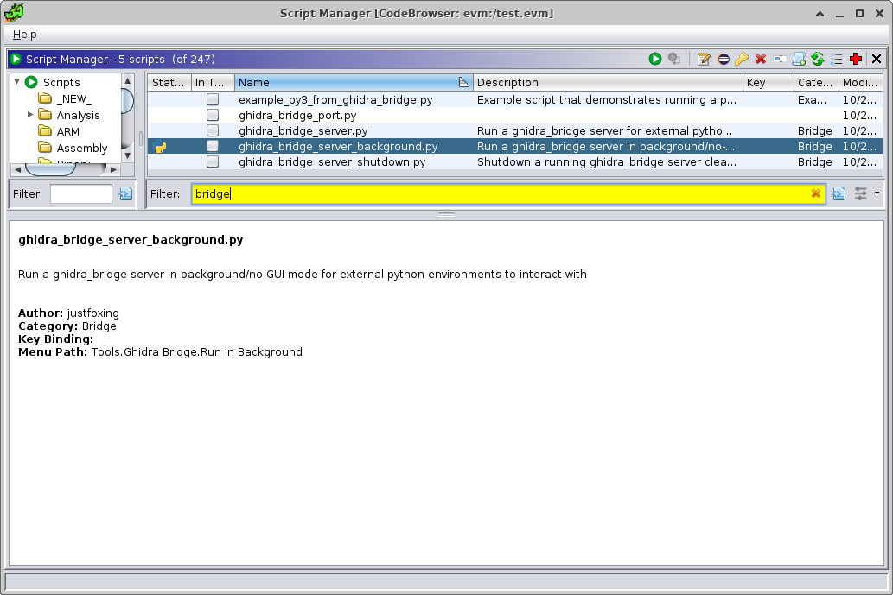
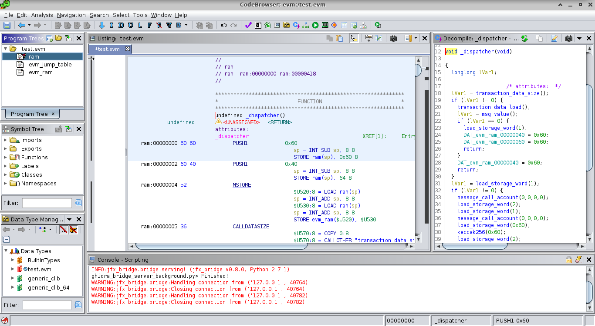
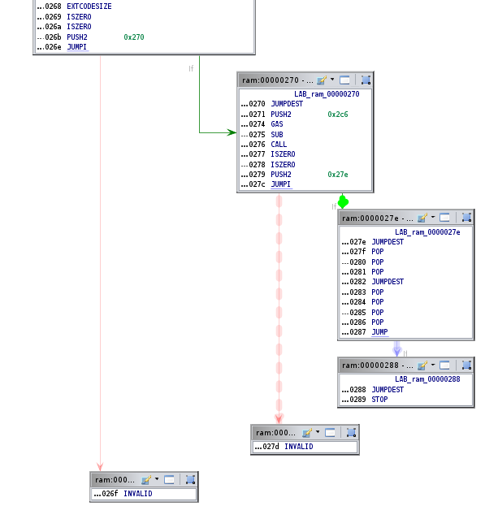

# Ghidra EVM Module

ghidra-evm is a ghidra loader and plugin to reverse engineering Ethereum VM
(EVM) bytecode. This version uses the Ghidra 9.1.2 API.

## Instalation instructions

- Install ghidra_bridge, following the instructions at https://github.com/justfoxing/ghidra_bridge
- Install the crytic evm_cfg_builder library, following the instructions at https://github.com/crytic/evm_cfg_builder
- Install the last ghidra-evm release file at ghidra_evm/dist/:
	- Open ghidra
	- File -> Install Extensions
	- Click on '+' and select the zip file e.g. ghidra_9.1.2_PUBLIC_20201102_ghidra_evm.zip
	- Click OK 
	- Restart Ghidra

## Utilization

ghidra-evm detects EVM bytecode in files with extension .evm and .evm_h. The
latter being generated via solc using the --bin and --bin-runtime options.
On the other hand, EVM bytecode can be encoded in binary in a .evm file
without any magic number of tags.

Hex code can be converted  to a .evm file via python using for instance a modified version of
convert_bytecode.py (see ethersplay, https://raw.githubusercontent.com/crytic/ethersplay/master/utils/convert_bytecode.py)

```
#!/usr/bin/python
import sys

if __name__ == '__main__':
    if len(sys.argv) != 3:
        print("Usage: python convert_bytecode.py input.evm output.bytecode")
        exit(0)

    filename_input = sys.argv[1]
    filename_output = sys.argv[2]

    f = open(filename_input, 'r')
    code = f.read()
    f.close()

    code = code.replace('\n', '')
    code_evm = bytes.fromhex(code)

    f = open(filename_output, 'wb')
    f.write(code_evm)
    f.close()
```

- Launch ghidra, create a new project and import a .evm file. You can use the examples available at
  examples/



- Press OK and open the evm file in CodeBrowser
- Click No to Analyze
- Launch  ghidra_bridge_server_background.py



- Run evm_helper.py. This script will fill the jump table of the contract and explore the functions, thus creating the CFG using the
  crytic evm_cfg_builder library.

```
$ python3 evm_helper.py 
       _     _     _                                      
  __ _| |__ (_) __| |_ __ __ _        _____   ___ __ ___  
 / _` | '_ \| |/ _` | '__/ _` |_____ / _ \ \ / / '_ ` _ \ 
| (_| | | | | | (_| | | | (_| |_____|  __/\ V /| | | | | |
 \__, |_| |_|_|\__,_|_|  \__,_|      \___| \_/ |_| |_| |_|
 |___/                                                    

[*] Reading RAM....
```

- You can now explore the CFG, the functions and their properties as well as the disassemble code.




### Notes and limitations

- ghidra_bridge has a considerable latency when reading memory from Ghidra into
  python3.
- The CFG is created according to evm_cfg_builder, this means that mainly
the JUMP and JUMPI instructions are utilized. A jump table of 16x16 is
utilized to detect and show branches in the disassembly and control flow windows.
- ghidra has not been designed to deal with architectures of wordsizes >
64-bit. That means that supporting long instructions such as PUSH32 in
SLEIGH should be done using alternative memory structures. Further, given
the wordsize limitation in Ghidra, ghidra-evm only supports compiled
contracts with branches in the first 0xffff instructions.

### TODO

- Implement memory structures for dealing with instructions having
large operands such as PUSH32 in order to improve the decompilation
process.
- Implement the storage functionality of Ethereum


 


