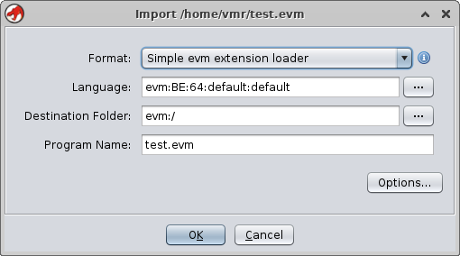
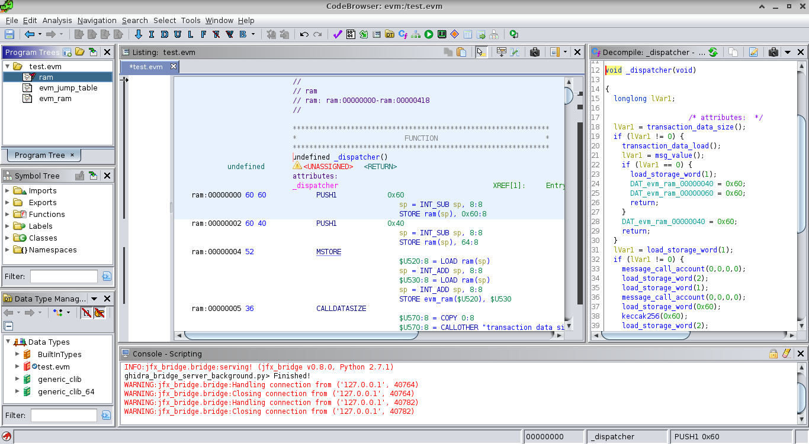
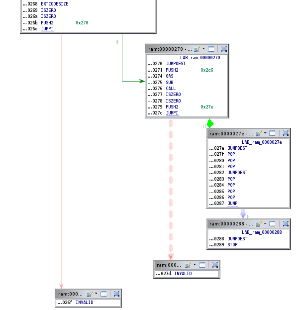

## Utilization

ghidra-evm detects EVM bytecode in files with extension .evm and .evm_h. The
latter being generated by writing the hex string that solc creates using the --bin and --bin-runtime options.
On the other hand, EVM bytecode can be encoded in binary in a .evm file
without a magic number / tag.

- Launch ghidra, create a new project and import a .evm file. You can use the examples available at
  examples/



- Press OK and open the evm file in CodeBrowser
- Click No to Analyze
- Launch  ghidra_bridge_server_background.py


- Run evm_helper.py with the byte code file as argument. This script will fill the jump table of the contract and explore the functions, thus creating the CFG using the
  crytic evm_cfg_builder library.

```
       _     _     _                                      
  __ _| |__ (_) __| |_ __ __ _        _____   ___ __ ___  
 / _` | '_ \| |/ _` | '__/ _` |_____ / _ \ \ / / '_ ` _ \ 
| (_| | | | | | (_| | | | (_| |_____|  __/\ V /| | | | | |
 \__, |_| |_|_|\__,_|_|  \__,_|      \___| \_/ |_| |_| |_| v.0.1
 |___/                                                    

Usage: python(3) evm_helper.py input.[evm | evm.h]
```

- You can now explore the CFG, the functions and their properties as well as the disassemble code.



