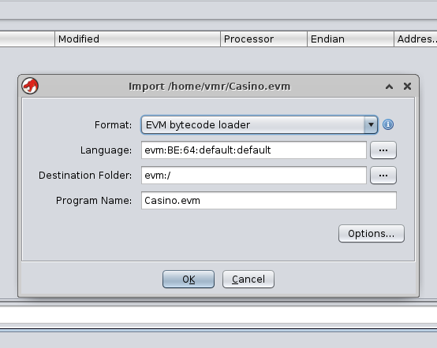

## Analyzing creation bytecode

In this tutorial we analyze casino.evm. This is creation bytecode and we
will demonstrate how to find the methods of the smart contract. 

First, we load casino.evm in Ghidra:



And load the ghidra_bridge server in the background as we did in the first
tutorial:


When we launch evm_helper.py, only one function, the _dispatcher is found:

```
$ python3 helper/evm_helper.py casino.evm 
       _     _     _                                      
  __ _| |__ (_) __| |_ __ __ _        _____   ___ __ ___  
 / _` | '_ \| |/ _` | '__/ _` |_____ / _ \ \ / / '_ ` _ \ 
| (_| | | | | | (_| | | | (_| |_____|  __/\ V /| | | | | |
 \__, |_| |_|_|\__,_|_|  \__,_|      \___| \_/ |_| |_| |_| v.0.1
 |___/                                                    

[*] Parsing bytecode...

[...]

[*] Setting analysis options....
[*] Creating CFG...
[*] Resolving jumps...
<cfg BasicBlock@83-89>
Finishes at:  0x89
	JUMP to: 0x8a
<cfg BasicBlock@0-10>
Finishes at:  0x10
	JUMPI to:  0x15
<cfg BasicBlock@15-82>
Finishes at:  0x82
	JUMPI to:  0x8a
[*] Exploring functions...
	Found function _dispatcher
[*] Analyzing....
[*] Disassemble all....
```


This functions calls CODECOPY from 0x9a with a size of 0x967 bytes.
We can try to load this code, extract its CFG and try to find functions
using scripts/search_codecopy:

```
       _     _     _                                      
  __ _| |__ (_) __| |_ __ __ _        _____   ___ __ ___  
 / _` | '_ \| |/ _` | '__/ _` |_____ / _ \ \ / / '_ ` _ \ 
| (_| | | | | | (_| | | | (_| |_____|  __/\ V /| | | | | |
 \__, |_| |_|_|\__,_|_|  \__,_|      \___| \_/ |_| |_| |_| v.0.1
 |___/                                                    

[*] Looking for _dispatcher...
[*] Searching for CODECOPY operands...
	CODECOPY found at ram:00000021
	CODECOPY found at ram:00000095
	CODECOPY found at ram:00000978
[*] Reading RAM: 0x967 bytes at 0x9a
```


We see that up to 3 CODECOPY instructions are found. The last one
corresponds to a byte of the metadata hash and we ignore it. The first one
contains a subset of the bytes of the second one, at 0x95 that we use to
analyze its CFG further on:

```
[*] Exploring functions...
	Found function:  _dispatcher at:  ram:0000009a
	Found function:  _fallback at:  ram:0000013e
	Found function:  numberOfBets() at:  ram:00000140
	Found function:  checkPlayerExists(address) at:  ram:0000016b
	Found function:  kill() at:  ram:000001c6
	Found function:  playerInfo(address) at:  ram:000001dd
	Found function:  bet(uint256) at:  ram:0000023b
	Found function:  owner() at:  ram:0000025b
	Found function:  0xab62a0a0 at:  ram:000002b2
	Found function:  minimumBet() at:  ram:000002dd
	Found function:  players(uint256) at:  ram:00000308
	Found function:  totalBet() at:  ram:00000375
[*] Analyzing....
[*] Disassemble all....
```

We can now see the function selector and the different JUMPS where the method
chosen to be executed by the contract is sent:


As well as a list of new functions detected by cfg_evm_builder:


