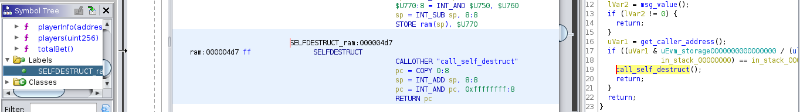

## Using search_dangerous_instructions.py to analyze a SELFDESTRUCT ocurrence

Instructions such as CALL, CALLCODE, SELFDESTRUCT and DELEGATECALL can sometimed be abused to transfer funds to another contract. 
This tutorial is a continuation of [Analyzing creation
bytecode](https://github.com/adelapie/ghidra-evm/blob/main/tutorials/01_codecopy.md). After analyzing the runtime code via
the helper and finding the smart contract methods via search_codecopy.py, we can try to find dangergous
instructions in the contract:

```
$ python3 scripts/search_dangerous_instructions.py 
       _     _     _                                      
  __ _| |__ (_) __| |_ __ __ _        _____   ___ __ ___  
 / _` | '_ \| |/ _` | '__/ _` |_____ / _ \ \ / / '_ ` _ \ 
| (_| | | | | | (_| | | | (_| |_____|  __/\ V /| | | | | |
 \__, |_| |_|_|\__,_|_|  \__,_|      \___| \_/ |_| |_| |_| v.0.1
 |___/                                                    

[*] Reading RAM: 2561 bytes at ram:00000000
[*] Searching dangerous instructions...
	[!] SELFDESTRUCT found at ram:000004d7
```

We can now check the labels in Ghidra and locate the instructions
that the script has found:



In this case, the kill() method is comparing the address of the caller with
the owner address before calling SELFDESTRUCT.
